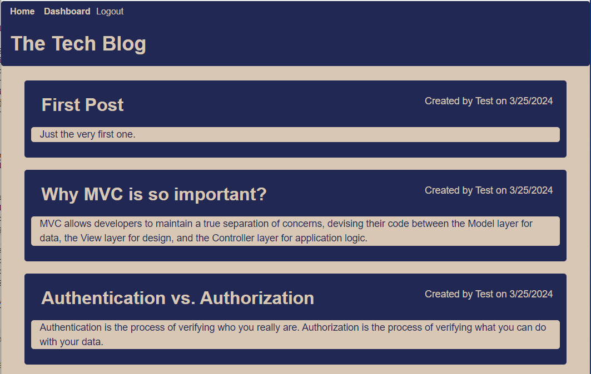

# Tech Blog

## Description

Tech Blog is a CMS-style blog site where user can publish their blog posts and comment on other users’ posts as well. It is designed follow the MVC paradigm in its architectural structure, using Handlebars.js as the templating language, Sequelize as the ORM, and the express-session npm package for authentication.

## Installation

Follow the below steps to install on local computer.

- Step 1: clone project to your local computer.
- Step 2: navigate to "Tech-Blog" folder.
- Step 3: modify .env.Example file in "Tech-Blog" folder with your MySQL credentials.
- Step 4: rename .env.Example to .env.
- Step 5: create database by running "source db/schema.sql" in mysql client.
- Step 6: run "npm install" to install the required modules which are listed in package.json.
- Step 7: run "node seeds/seed.js" to seed example data into the database.
- Step 8: run "npm start" to run the webpage at http://localhost:3001

## Usage

- Step 1: Use the link https://mysterious-ocean-87615-52c1d91464e5.herokuapp.com/ or [local link](http://localhost:3001) as local installation.
- Step 2: click on login on the nav bar and then choose sign up to create an account to start using webpage.

  Features:

- To see all current posts, click on "Home".
- To comment on a post, click on it and the comment input box will appear after all of the current comments.
- To create a new post, go to Dashboard, and click on "New Post".
- To edit/delete a post, go to Dashboard, and click on it and the edit form will appear.

        

## Credits

Website powered by [nodejs](https://nodejs.org/en), [express](https://www.npmjs.com/package/express), [mysql2](https://www.npmjs.com/package/mysql2), [Sequelize](https://www.npmjs.com/package/sequelize), [bcrypt](https://www.npmjs.com/package/bcrypt), [handlebars](https://www.npmjs.com/package/handlebars), [dotenv](https://www.npmjs.com/package/dotenv), [express-session](https://www.npmjs.com/package/express-session).
